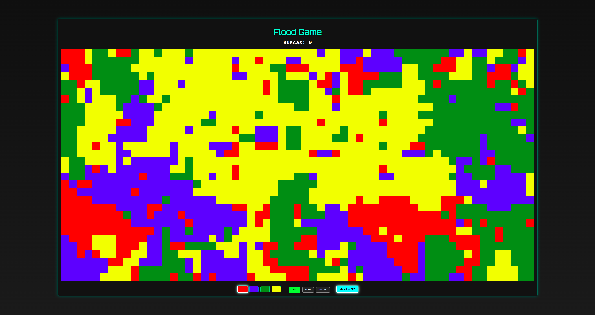
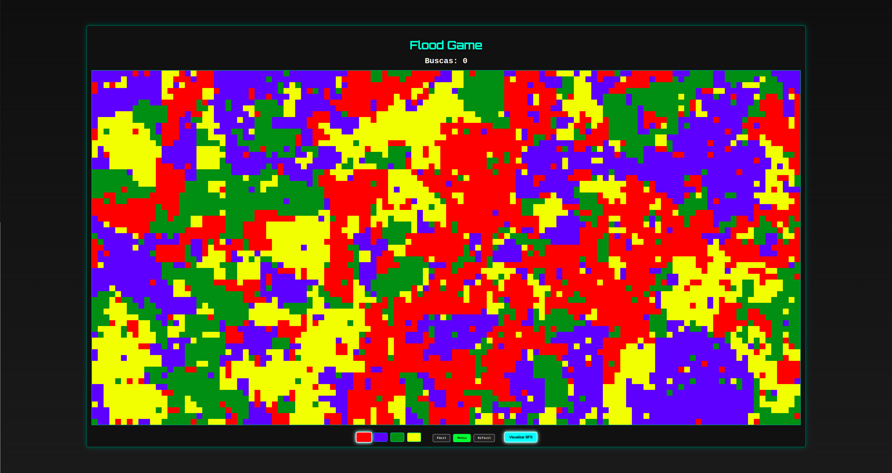
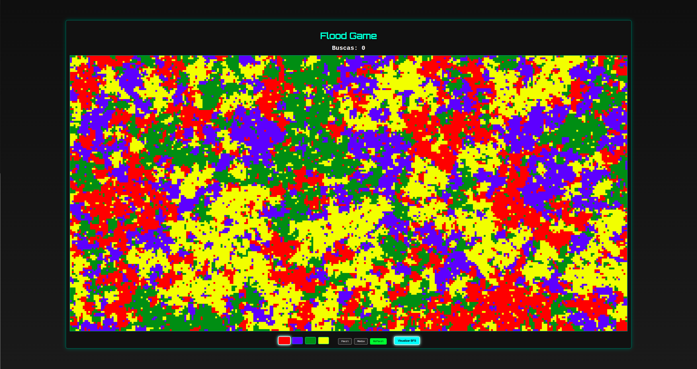
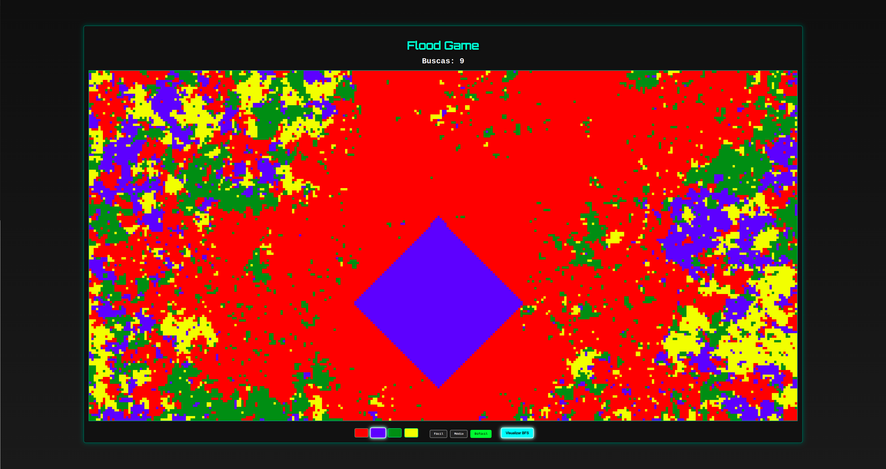
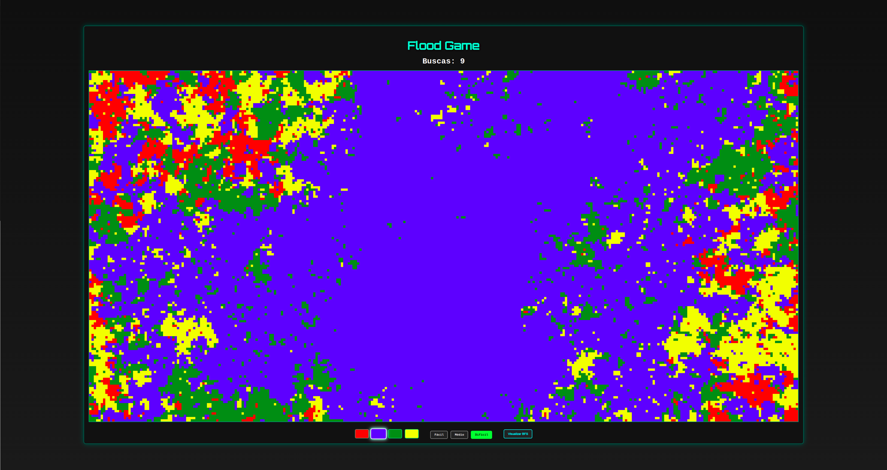

# Grafos 1 - Flood Game

**Número da Lista**: 1  
**Conteúdo da Disciplina**: Grafos 1

## Aluno

| Matrícula   | Nome                          |
|-------------|-------------------------------|
| 19/0048191  |     Renan Rodrigues Lacerda   |

## Sobre

Este projeto tem como objetivo aplicar conceitos de algoritmos de grafos de forma visual e interativa. A tela é interpretada como uma grade de células (ou seja, um grafo em forma de matriz), onde cada célula representa um nó. As conexões entre os nós são definidas por vizinhança (acima, abaixo, esquerda e direita), formando um grafo.

A busca em largura (BFS) é utilizada para percorrer regiões conectadas de mesma cor. Essa técnica permite, por exemplo, pintar regiões inteiras de uma só cor com base na célula clicada, simulando o comportamento do clássico algoritmo "Flood Fill".

Além disso, o jogo incentiva o uso estratégico da BFS para unificar toda a grade com a menor quantidade possível de buscas.

## Screenshots
### Grade com blocos maiores 
 
### Grades com blocos de tamanho intermediário que exigem mais estratégia.
 
### Blocos pequenos e uma malha densa
 
### Demonstração do jogo em execução, com a BFS rodando
 
### Exemplo da regiao totalmente preenchida, após a escolha de cor e propagação pelo algoritmo de busca.
 

## Instalação 
**Linguagem**: ***Javascript*** 
**Framework**: Nenhum 
**github pages**: [FloodGame](https://projeto-de-algoritmos-2025.github.io/Grafos1_FloodGame/) 
**Pré-requisitos**
Navegador atualizado (Google Chrome, Firefox, Edge, etc.) 
Este projeto não requer instalação de dependências ou execução de servidores. Basta abrir o arquivo index.html em qualquer navegador moderno, ou abrir a versao no github pages. 
## Uso 

### Passos para rodar o jogo:

1. **Selecione uma cor para preencher**  
   Clique em um dos botões de cor disponíveis na parte inferior da tela para escolher qual cor você vai usar para preencher a área do grid.

2. **Escolha o nível de dificuldade**  
   Após selecionar a cor, escolha o nível de dificuldade clicando no botão correspondente. Isso ajustará o tamanho das células do grid:
   - **Fácil**: Blocos grandes.
   - **Médio**: Blocos de tamanho intermediário.
   - **Difícil**: Blocos pequenos, mais desafiadores.

3. **Clique na célula para preenchê-la**  
   Clique em qualquer célula no grid com a mesma cor da célula que você clicou para começar a preenchê-la com a cor selecionada.

4. **Acompanhe seu progresso**  
    A cada clique, o número de buscas será atualizado. O objetivo é deixar todos os quadrados com a mesma cor usando o menor número de buscas possível.
5. **Controle de animação**  
   Se você ativar a animação, o preenchimento ocorrerá com um pequeno delay, permitindo que você visualize o funcionamento do algoritmo de busca em largura sendo feito célula por célula. Você pode ativar ou desativar a animação no controle da interface.

## Outros 
- O projeto é leve e roda 100% no navegador.